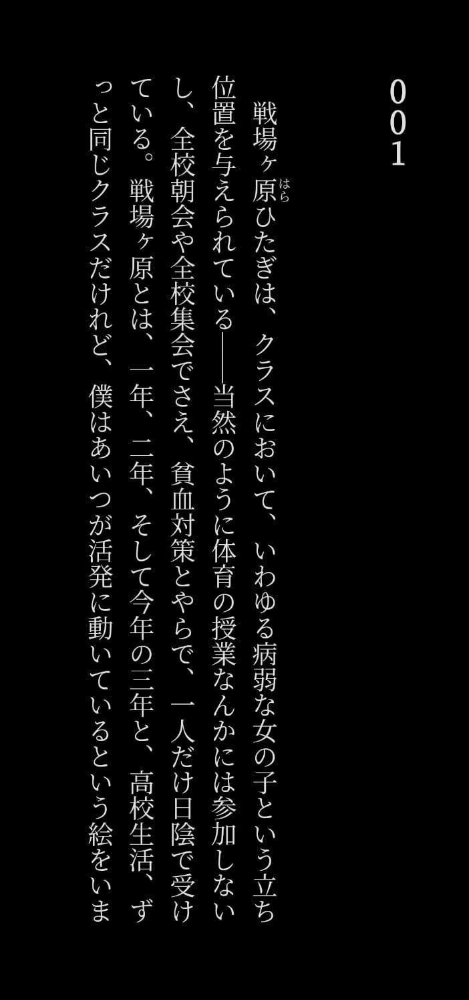
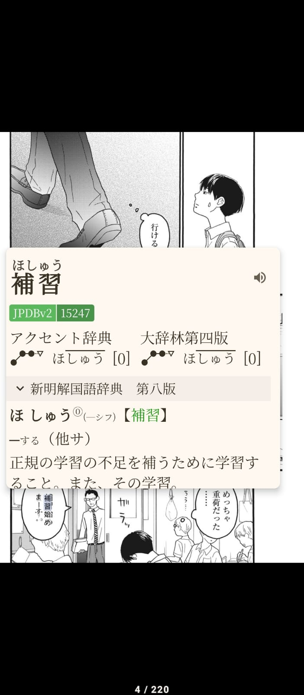
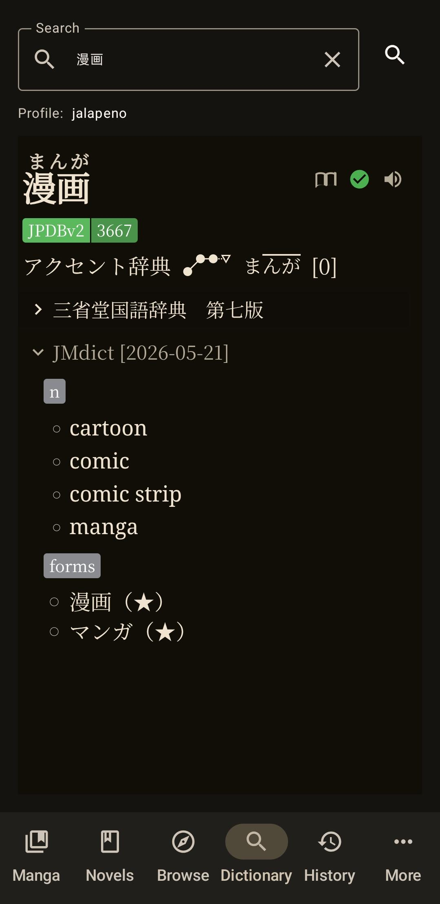

<h1 align="center">Chimahon</h1>

**Mihon-focused immersion fork with Manga and Novel support.**

---

Chimahon is a specialized Android reader designed for language learners and immersion enthusiasts. It extends the powerful core of **Mihon/Komikku** with integrated tools for dictionary lookup, OCR-assisted text capture, and seamless flashcard creation for vocabulary mining.

## 🖼️ Screenshots

  
  
  

## 🚀 Key Immersion Features

### 📖 Novel & Manga Support
- **Novel Reader**: Dedicated reader for e-books with integrated dictionary lookup. Based on [Hoshi Reader](https://github.com/Manhhao/Hoshi-Reader).
- **Manga Reader**: Native reading experience with support for all major online and local sources.
- **Local OCR**: High-performance, on-device text recognition — no internet connection required.
- **.mokuro Support**: Native integration for reading `.mokuro` formatted manga files with pre-rendered OCR overlays.

### 🔍 Native Dictionary Lookup
- **Dictionary Tab**: Import and manage multiple dictionary files directly in-app.
- **Multi-Language Support**: Full support for Japanese, Chinese, Korean, and more.
- **Recursive Lookups**: Effortlessly search within definitions to clarify complex terms.
- **Slick Dictionary Popup**: A modern, customizable lookup interface with support for custom fonts, themes, and recursive searches.
- **E-Ink Optimized**: High-contrast mode designed specifically for e-paper devices.
- **Pitch Accent**: Native support for visualizing Japanese pitch accent patterns.

### 🎴 Anki Integration
- **Direct Mining**: Create Anki cards instantly from lookup results while reading.
- **Screenshot Crop**: Manually crop images for your cards with specialized UI.
- **Smart Markers**: Flexible field mapping for expression, reading, glossary, pitch, and context sentences.
- **Duplicate Checking**: Reliable duplicate detection to prevent redundant flashcards.

---

## 🛠️ Core Features (Inherited from Upstream)

Chimahon retains all the features of **Komikku** and **Mihon**:

  

- **Massive Source Support**: Access thousands of manga via community-made extensions.
- **Suggestions**: Discover related titles directly within the app.
- **Auto-Theme**: UI colors that adapt to the cover art of what you're reading.
- **Cloud Sync**: 2-way progress tracking with MyAnimeList, AniList, Kitsu, and more.
- **Privacy & Backups**: Hidden categories and secure backups (Local or Cloud).
- **Customization**: Extensive theme options, color palettes, and reader settings.

---

## 📥 Download

*Requires Android 8.0 or higher.*

---

## 🤝 Contributing & Support

- **Bugs/Requests**: Please check the [Changelog](./CHANGELOG.md) and open an [Issue](https://github.com/sohilsayed/chimahon/issues).
- **Discord**: Join our community for help and discussion: [Join Discord](https://discord.gg/Ak2sW9Nvr9)
- **Contributing**: Pull requests are welcome! See [CONTRIBUTING.md](./CONTRIBUTING.md) for details.

### Credits & Acknowledgments

- [Yomitan](https://github.com/yomidevs/yomitan): Inspiration for language-processing workflows.
- [owocr](https://github.com/AuroraWright/owocr): Base for OCR merge and reconstruction logic.
- [hoshidicts](https://github.com/Manhhao/hoshidicts/): Native dictionary engine powering our lookups.
- [Machita Chima (町田ちま)](https://www.youtube.com/channel/UCo7TRj3cS-f_1D9ZDmuTsjw): App name inspiration.

### License

This project is licensed under the **GNU General Public License v3.0**. See [LICENSE](./LICENSE) for details.

---

  
Made with ❤️ for the immersion community.

  

